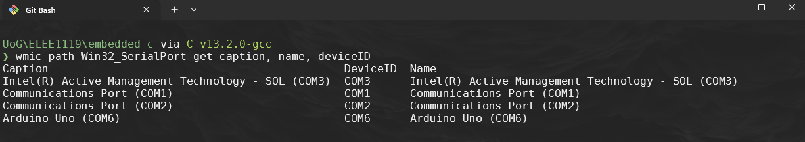

# PWM Workbook: Configuring PWM on the ATmega328P

## 1. Introduction to PWM on ATmega328P


~~~admonish info

PWM is a technique to control the average power supplied to electronic components by varying the duty cycle of a square wave. The ATmega328P offers several timers that can generate PWM signals. In this workbook, we focus on using `Timer0` to generate an 8-bit PWM signal on `OC0A` (Pin `PD6`).

~~~

---

## 2. `Timer0` Registers for PWM

`TCCR` stands for **Timer/Counter Control Register**. On the ATmega328P and similar microcontrollers, these registers control the behavior of each timer/counter module.

Each timer has one or more `TCCR` registers that configure aspects such as:

- PWM mode (e.g., Fast PWM, Phase Correct PWM)
- Compare Output Mode (inverting or non-inverting PWM signal)
- Clock source and prescaler (e.g., no prescaler, prescaler of 8, 64, etc.)

### 2.1 Types of TCCR Registers on ATmega328P

The ATmega328P has three timers, each with associated TCCR registers:

1. `Timer0` (8-bit):

    - `TCCR0A` and `TCCR0B`: These control the settings for `Timer0`, including PWM configuration, clock selection, and output modes.

2. `Timer1` (16-bit):

    - `TCCR1A` and `TCCR1B`: These control `Timer1`, which supports 16-bit resolutions. This is useful for applications needing finer control, such as precise PWM or high-resolution counters.

3. `Timer2` (8-bit):

    - `TCCR2A` and `TCCR2B`: These control `Timer2`, similar to `Timer0` but with different prescaler and clock source options.

### 2.2 TCCR0A - Timer/Counter Control Register A
| Bit  | 7      | 6      | 5      | 4      | 3      | 2      | 1      | 0      |
|------|--------|--------|--------|--------|--------|--------|--------|--------|
| Name | COM0A1 | COM0A0 | COM0B1 | COM0B0 | -      | -      | WGM01  | WGM00  |

- `COM0A1`: Compare Output Mode for `OC0A`.
  - Setting `COM0A1` to 1 enables non-inverting PWM output on `OC0A` (Pin `PD6`).
    ~~~admonish note

    - In non-inverting mode, the output starts high at the beginning of the timer cycle and goes low when the timer reaches the value in `OCR0A`.
    - The duty cycle is therefore determined by the value in `OCR0A`: a higher value keeps the signal high for a longer portion of the cycle

    ~~~

- `WGM01` and `WGM00`: Waveform Generation Mode.
  - Setting both `WGM01` and `WGM00` to 1 puts `Timer0` in **Fast PWM mode**.

### 2.3TCCR0B - Timer/Counter Control Register B

| Bit  | 7    | 6    | 5    | 4    | 3       | 2     | 1     | 0     |
|------|------|------|------|------|---------|-------|-------|-------|
| Name | FOC0A| FOC0B| -    | -    | WGM02   | CS02  | CS01  | CS00  |

- `CS02`:`CS00`: Clock Select bits.
  - Sets the prescaler to control the PWM frequency.
  - Example: Setting `CS01` and `CS00` to 1 (`CS01 | CS00`) applies a prescaler of 64 to the timer.

---

## 3. Prescalers

The **prescaler** in the ATmega328P (and similar microcontrollers) is a divider that reduces the main system clock **frequency** to a lower frequency for the timer. The prescaler allows you to control the frequency of the timer, which directly affects the speed of operations like **PWM** or delays that the timer generates.

### 3.1 Purpose of the Prescaler

The microcontroller’s main clock frequency is often quite high (e.g., 16 MHz on the ATmega328P). Running the timer directly at this speed would result in very high-frequency signals, making it challenging to create longer delays or lower-frequency PWM signals. The prescaler helps by slowing down the timer, making it easier to generate slower or more manageable signals.

### 3.2 How the Prescaler Works

The prescaler takes the main clock frequency and divides it by a specified factor, which is then used as the **input clock** for the timer. For example, if the system clock is 16 MHz and the prescaler is set to 64, then the timer operates at:

\\[250,000\ Hz\ =\ \frac{16,000,000\ Hz}{64}\\]

This effectively slows down the timer and allows more extended timing intervals or lower-frequency PWM output.

### 3.4 Prescaler Options on ATmega328P

Each timer on the ATmega328P has several prescaler options, typically selectable by configuring specific bits in the `TCCR` (Timer/Counter Control Register).

|Prescaler|Timer|
|----|----|
|No Prescaling|1|
|No Prescaling(direct clock input)|0, 2|
|8   |0, 1, 2|
|64  |0, 1, 2|
|256 |0, 1, 2|
|1024|0, 1, 2|

### 3.5 Example Calculation of PWM Frequency with a Prescaler

When using Fast PWM mode on an 8-bit timer, the PWM frequency can be calculated as:

\\[PWM\ Frequency\ =\ \frac{CPU\ Clock\ Frequency}{Prescaler\ \cdot 256}\\]

For example, with a 16 MHz CPU clock and a prescaler of 64:

\\[976\ Hz \approx\ \frac{16,000,000\ Hz}{64\cdot 256}\\]

This frequency can then be adjusted by changing the OCR(`OCR0A`) (Output Compare Register) values to control the duty cycle, with the prescaler setting determining the overall timing speed of the signal.

To set the prescaler for `Timer0` on the ATmega328P, you configure the `CS00`, `CS01`, and `CS02` bits in the `TCCR0B` register. Each combination of these bits determines a different prescaler value. Here’s how you can configure `Timer0` for prescalers of 8, 64, 256, and 1024.

### 3.6 Setting the Prescaler for `Timer0`


| CS02|	CS01|CS00|Prescaler|
|----|----|---|---|
| 0	| 0 | 1 | No prescaler (direct clock)|
| 0	| 1 | 0 | 8|
| 0	| 1 | 1 | 64|
| 1	| 0 | 0 | 256|
| 1	| 0 | 1 | 1024|

The following code snippets show how to set each prescaler in `TCCR0B`:

~~~admonish code

```c
TCCR0B = (1 << CS01); // Prescaler = 8

TCCR0B = (1 << CS01) | (1 << CS00); // Prescaler = 64

TCCR0B = (1 << CS02); // Prescaler = 256

TCCR0B = (1 << CS02) | (1 << CS00); // Prescaler = 1024
```

~~~

---

## 4. Building the `pwm.c` source code

~~~admonish warning

- Remember to include in your `PATH` `avr-gcc`, `avrdude` and `make`
- Open `~/.bashrc` and add the following lines, then save and run the command `source ~/.bashrc` to update the current session with the new `PATH`
  -  Uni machines
     ```sh
     # ~/.bashrc
     export PATH=$PATH:"/c/ProgramData/arduino-ide-v2/Local/Arduino15/packages/arduino/tools/avr-gcc/7.3.0-atmel3.6.1-arduino7/bin"
     export PATH=$PATH:"/c/ProgramData/arduino-ide-v2/Local/Arduino15/packages/arduino/tools/avr-dude/6.3.0-arduino17/bin"
     export PATH=$PATH:"/c/Program Files/GCC-Windows-MingW-2.0.0/w64devkit/bin"
     ```
  - Your personal windows machine
     ```sh
     # ~/.bashrc
     export PATH=$PATH:"/c/Users/YOURUSERNAME/AppData/Local/Arduino15/packages/arduino/tools/avr-gcc/7.3.0-atmel3.6.1-arduino7/bin"
     export PATH=$PATH:"/c/Users/YOURUSERNAME/AppDataLocal/Arduino15/packages/arduino/tools/avr-dude/6.3.0-arduino17/bin"
     export PATH=$PATH:"/c/Program Files/w64devkit/bin"
     ```
  - You can install w64devkit from here:
    - [https://github.com/skeeto/w64devkit/releases](https://github.com/skeeto/w64devkit/releases)

~~~

### 4.1 Basic pwm.ino

Now we have an understanding of the what is going on under the hood we can convert this `pwm.ino` into and embedded version.

~~~admonish code

```c
int pwmPin = 6;      // LED connected to digital pin 9

void setup() {
    pinMode(pwmPin, OUTPUT);  // sets the pin as output
    analogWrite(ledPin, 127); // analogRead values go from 0 to 1023, analogWrite values from 0 to 255
}

void loop(){}
```

~~~

~~~admonish example title="Explanation"

Let's have a breakdown of what this is doing incomparison to the embedded version:

- PWM Configuration:

    - Using `analogWrite(pwmPin, 127);` automatically configures PWM on pin 6 with a duty cycle of 50% (127 out of 255).

    - `analogWrite()` abstracts away the details of configuring the timer registers (like `TCCR0A` and `TCCR0B`) and prescalers, making it simpler but less flexible.

- PWM Frequency and Prescaler:

    - With `analogWrite()`, you don’t have control over the prescaler or the PWM frequency. Arduino’s default frequency for `Timer0` (used for pins 5 and 6) is typically around 976 Hz on an ATmega328P running at 16 MHz.

    - In the examples below, we can manually set `TCCR0B`, we will choose between different prescalers to adjust the PWM frequency. This will allow for finer control over the PWM signal characteristics.

~~~

### 4.2 Create `pwm.c`

1. Create a new directory inside `embeddedC` called `pwm`
    ~~~admonish terminal

    ```sh
    $ mkdir -p ~/embeddedC/pwm && cd embeddedC/pwm
    ```
    
    ~~~

2. Create a new file inside the the `pwm` directory called `pwm.c`

    ~~~admonish code

    ```sh
    $ touch pwm.c
    ```

    ~~~

3. Now it's time start wrighting out the program:

    ~~~admonish code

    ```c
    #include <avr/io.h>

    void PWM_Init()
    {
        // Set PD6 (OC0A) as output
        DDRD |= (1 << PD6); // PWM pin 6

        // Set Timer0 to Fast PWM mode with non-inverting output on OC0A
        TCCR0A = (1 << COM0A1) | (1 << WGM01) | (1 << WGM00);

        // Set the prescaler to 64 for Timer0
        TCCR0B = (1 << CS01) | (1 << CS00);

        // Initialize with 0% duty cycle
        OCR0A = 0;
    }

    int main()
    {
        PWM_Init(); // Initialize PWM on PD6

        while (1) {
            // Adjust OCR0A as needed for duty cycle from 0 to 255
            OCR0A = 127; // Example: 50% duty cycle
        }
    }
    ```

    ~~~

    ~~~admonish example title='Explanation of code'
    
    1. **Setting PD6 as Output**:
         - `DDRD |= (1 << PD6);` configures PD6 as an output pin to output the PWM signal.
    2. **Configuring Timer0 for Fast PWM Mode**:
         - **TCCR0A**:
             - `(1 << COM0A1)`: Sets non-inverting mode for PWM on OC0A.
             - `(1 << WGM01) | (1 << WGM00)`: Sets Fast PWM mode.
         - **TCCR0B**:
             - `(1 << CS01) | (1 << CS00)`: Sets a prescaler of 64, controlling the PWM frequency.
    . **Setting the Duty Cycle**:
         - **OCR0A**: Controls the duty cycle. A value of 127 provides approximately a 50% duty cycle.
         - **Range**: `OCR0A` can range from 0 to 255, where:
             - **0**: 0% duty cycle (always low)
             - **127**: 50% duty cycle
             - **255**: 100% duty cycle (always high)

    ~~~

4. We are now going to copy the `Makefile` from the `blink/` created last time, and replace all instances of `blink` with `pwm` using the regex feature:

    ~~~admonish terminal

    ```sh
    $ cp ../blink/Makefile .
    $ vim Makefile
    ```
    
    ~~~
    
5. Inside vim type the following an press enter to find all instances of `blink` with `pwm`
    
    ~~~admonish terminal

    ```vim
    :%s/\<blink\>/pwm/g
    ```

    

    ~~~

6. Remember like with blink we need to compile and upload the code to the board, ensure it is plugged in, to find the com port on windows:

    

7. If the COM port has changed remember to change it in the `Makefile`
    
    ~~~admonish code

    ```Makefile
    PORT = COM#
    ```

    ~~~

8. Use `make`:

    - `make clean`
    - `make` 
    - `make upload`

9. Ensure you have wired up an led circuit in to pin 6 with a 220\\(\Omega\\) resistor

-------------

## 5. Exercises

### 5.1 Exercise 1: Changing the Duty Cycle
Modify the `OCR0A` register in the `main` loop to create different duty cycles. For example, try setting it to 64, 127, and 192. Observe how the brightness of an LED connected to PD6 changes.

**Task**:
- Set `OCR0A = 64;` // ~25% duty cycle
- Set `OCR0A = 192;` // ~75% duty cycle
- Record the observed LED brightness.

### 5.2 Exercise 2: Creating a Smooth Fade Effect
Modify the code to gradually increase the duty cycle from 0 to 255 and then decrease it back to 0 to create a smooth "breathing" LED effect.

**Hint**:
- Use a `for` loop to increment `OCR0A` from 0 to 255, adding a delay between each increment.
- Then, use another `for` loop to decrement it from 255 back to 0.


    ~~~admonish code collapsible=true title='Suppress code here... [31 lines]'

    ```c
    #include <avr/io.h>

    void PWM_Init()
    {
        // Set PD6 (OC0A) as output
        DDRD |= (1 << PD6); // PWM pin 6

        // Set Timer0 to Fast PWM mode with non-inverting output on OC0A
        TCCR0A = (1 << COM0A1) | (1 << WGM01) | (1 << WGM00);

        // Set the prescaler to 64 for Timer0
        TCCR0B = (1 << CS01) | (1 << CS00);

        // Initialize with 0% duty cycle
        OCR0A = 0;
    }

    int main()
    {
        PWM_Init(); // Initialize PWM on PD6

        while (1) {
            for (uint8_t i = 0; i <= 255; i++) {
                OCR0A = i;
                _delay_ms(10); // Adjust delay as needed
            }
            for (uint8_t i = 255; i > 0; i--) {
                OCR0A = i;
                _delay_ms(10); // Adjust delay as needed
            }
        }
    }
    ```

    ~~~
    

### 5.3 Exercise 3: Changing the PWM Frequency
Experiment with different prescaler values to change the PWM frequency. Change the **CS02:CS00** bits in **TCCR0B** to see the effects.

**Task**:
- Try prescalers of 8, 64, and 256, and observe how the frequency and brightness change.
