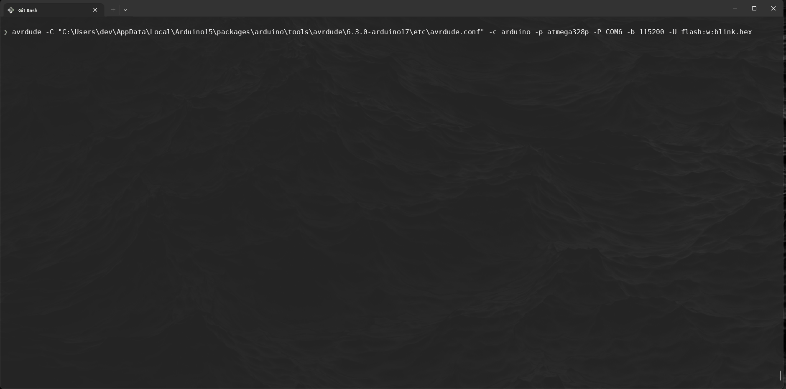

# Blink

~~~admonish warning
- Remember to include in your `PATH` `avr-gcc`, `avrdude` and `make`
- Open `~/.bashrc` and add the following lines, then save and run the command `source ~/.bashrc` to update the current session with the new `PATH`
  -  Uni machines
     ```sh
     # ~/.bashrc
     export PATH=$PATH:"/c/ProgramData/arduino-ide-v2/Local/Arduino15/packages/arduino/tools/avr-gcc/7.3.0-atmel3.6.1-arduino7/bin"
     export PATH=$PATH:"/c/ProgramData/arduino-ide-v2/Local/Arduino15/packages/arduino/tools/avr-dude/6.3.0-arduino17/bin"
     export PATH=$PATH:"/c/Program Files/GCC-Windows-MingW-2.0.0/w64devkit/bin"
     ```
  - Your personal windows machine
     ```sh
     # ~/.bashrc
     export PATH=$PATH:"/c/Users/YOURUSERNAME/AppData/Local/Arduino15/packages/arduino/tools/avr-gcc/7.3.0-atmel3.6.1-arduino7/bin"
     export PATH=$PATH:"/c/Users/YOURUSERNAME/AppDataLocal/Arduino15/packages/arduino/tools/avr-dude/6.3.0-arduino17/bin"
     export PATH=$PATH:"/c/Program Files/w64devkit/bin"
     ```
  - You can install w64devkit from here:
    - [https://github.com/skeeto/w64devkit/releases](https://github.com/skeeto/w64devkit/releases)

~~~

So you are no doubt familiar with the well known `blink.ino`:

~~~admonish code

```c
// the setup function runs once when you press reset or power the board
void setup() {
  // initialize digital pin LED_BUILTIN as an output.
  pinMode(LED_BUILTIN, OUTPUT);
}

// the loop function runs over and over again forever
void loop() {
  digitalWrite(LED_BUILTIN, HIGH);  // turn the LED on (HIGH is the voltage level)
  delay(1000);                      // wait for a second
  digitalWrite(LED_BUILTIN, LOW);   // turn the LED off by making the voltage LOW
  delay(1000);                      // wait for a second
}
```

~~~

There is a lot of abstraction happening here, where are the ports/registers? 

Let's now turn this into an embedded program!


## Create `blink.c`

1. Create a new directory called `embeddedC` and a child directory `blink`

    ~~~admonish terminal
    
    ```sh
    $ mkdir -p ~/embeddedC/blink && cd embeddedC/blink
    ```
    
    ~~~

2. Create a new file inside the the `blink` directory called `blink.c`

    ~~~admonish terminal

    ```sh
    $ touch blink.c
    ```

    ~~~

3. Now it's time start wrighting out the program:

    ~~~admonish code 

    ```c
    #include <avr/io.h> // provides macros and definitions for accessing registers and hardware-specific functions of AVR microcontrollers

    #define F_CPU 16000000UL
    
    #include <util/delay.h> // provides delay functions, including _delay_ms() for millisecond delays

    #define BLINK_DELAY_MS 2000

    int main (void)
    {
        // Arduino digital pin 13 (pin 5 of PORTB) for output
        DDRB |= 0b00100000; // PORTB5

        while(1) {
            // turn LED on
            PORTB |= 0b00100000; // PORTB5
            _delay_ms(BLINK_DELAY_MS);

            // turn LED off
            PORTB &= ~ 0b00100000; // PORTB5
            _delay_ms(BLINK_DELAY_MS);
        }
    }
    ```

    ~~~
    
    ~~~admonish example title='Explanation bitwise operations'

    - `|=` operator is used to set (turn on) specific bits without changing others. It performs a bitwise OR operation with the current value of a register, setting only the bits t correspond to 1 in the mask.
      - ```c
        // Initial value: all bits are 0
        uint8_t register_value = 0b00000000; 
            // Set bit 2
        register_value |= (1 << 2); // 0b00000100
            // Result: register_value = 0b00000100 (Bit 2 is now set)
          ```
        - `&= ~` to clear (turn off) a specific bit, we use the &= operator combined with the bitwise NOT `~`. This combination creates a mask where only the desired bit is set to 0, le all other bits are 1. The `&=` operation then turns off the targeted bit without affecting others
      - ```c
        // Initial value: all bits are 0
        uint8_t register_value = 0b00000000; 
            // Set bit 2
        register_value &= ~(1 << 2); // 0b11111011
            // Result: register_value = 0b00000000 (Bit 2 is now set)
          ```
    ~~~
------------------

## Compiling: Object file

4. We need to compile the code so that it can be uploaded to the atmega328p chip:

    - we are going to be using the `avr-gcc` compiler to first create the object file:
    
    ~~~admonish terminal

    ```sh
    $ avr-gcc -Os -mmcu=atmega328p -DF_CPU16000000UL -c -o blink.o blink.c`
    ```
    
    ~~~

    ~~~admonish exmample title='Command Breakdown'

    - `-Os`

        - `-mmcu=atmega328p` configures the compilation process to generate code compatible with the ATmega328P's specific architecture, instruction set, and memory layout

        - `-DF_CPU=16000000UL` the `-D` option defines a macro (`F_CPU`) that will be used in the code, similar to adding `#define F_CPU 16000000UL` (16MHz) at the top of `blink.

        - `-c` flag tells avr-gcc to compile the source file into an object file (.o) rather than a full executable

        - `-o` specifies the output file for the compilation. `-o` allows you to name the output file, which in this case is `blink.o`

    ~~~

5. Exploring the object file, run the following the command `avr-objdump -d -S blink.o`:

    ~~~admonish terminal 

    ```sh
    $ avr-objdump -d -S blink.o
    ```

    ~~~

    output

    ~~~admonish output

    ```asm
    blink.o:     file format elf32-avr

    Disassembly of section .text.startup:

    00000000 <main>:
    0:    25 9a           sbi     0x04, 5 ; 4
    2:    2d 9a           sbi     0x05, 5 ; 5
    4:    2f ef           ldi     r18, 0xFF       ; 255
    6:    87 ea           ldi     r24, 0xA7       ; 167
    8:    91 e6           ldi     r25, 0x61       ; 97
    a:    21 50           subi    r18, 0x01       ; 1
    c:    80 40           sbci    r24, 0x00       ; 0
    e:    90 40           sbci    r25, 0x00       ; 0
    10:   01 f4           brne    .+0             ; 0x12 <main+0x12>
    12:   00 c0           rjmp    .+0             ; 0x14 <main+0x14>
    14:   00 00           nop
    16:   2d 98           cbi     0x05, 5 ; 5
    18:   2f ef           ldi     r18, 0xFF       ; 255
    1a:   87 ea           ldi     r24, 0xA7       ; 167
    1c:   91 e6           ldi     r25, 0x61       ; 97
    1e:   21 50           subi    r18, 0x01       ; 1
    20:   80 40           sbci    r24, 0x00       ; 0
    22:   90 40           sbci    r25, 0x00       ; 0
    24:   01 f4           brne    .+0             ; 0x26 <main+0x26>
    26:   00 c0           rjmp    .+0             ; 0x28 <main+0x28>
    28:   00 00           nop
    2a:   00 c0           rjmp    .+0             ; 0x2c <__zero_reg__+0x2b>
    ```

    - `sbi 0x04, 5`: Set bit `5` in the I/O register at address 0x04, typically used to configure a pin as an output. The `sbi` instruction sets a specific bit in an I/O register.

    - `ldi r18, 0xFF`: Load the constant `0xFF` (255 in decimal) into register `r18`. This sets up a value, often for delays or looping.

    - `subi r18, 0x01`: Subtracts 1 from r18. This, along with the `sbci` instructions, forms a delay loop by decrementing registers `r18`, `r24`, and `r25` until they reach zero.

    - `brne .+0`: Branch if not equal (loop back if r18, r24, or r25 is non-zero). The program will keep looping here to create a delay.

    - `rjmp .+0`: Relative jump (infinite loop). This is often used to create a long delay or an idle state. The program will stall here until an external reset or interrupt occurs.

    - `cbi 0x05, 5`: Clear bit 5 in I/O register `0x05`, likely to turn off the LED.

    - `sbi`/`cbi` instructions toggle an LED pin on and off.

    - `ldi`, `subi`, `sbci`, and `brne` form delay loops by decrementing registers until they reach zero.

    - `rjmp` and `nop` provide additional delays or idle periods

    ~~~

    ~~~admonish info
    
    All information can be found here for ISA [AVR Instruction Set](https://ww1.microchip.com/downloads/en/DeviceDoc/AVR-Instruction-Set-Manual-DS40002198A.pdf)
    
    ~~~
------------------

## Compiling: `.elf` (Executable and Linkable Format) file

6. Now we can make the `.elf` (Executable and Linkable Format) file, run the following code:

    ~~~admonish terminal

    ```sh
    $ avr-gcc -Os -DF_CPU=16000000 -mmcu=atmega328p -o blink.elf blink.o
    ```

    ~~~

5. Exploring the object file, run the following the command:

    ~~~admonish terminal

    ```sh
    $ avr-objdump -h -s blink.elf
    ```

    ~~~

    ~~~admonish output

    ```elf

    blink.elf:     file format elf32-avr

    Sections:
    Idx Name          Size      VMA       LMA       File off  Algn
    0 .data         00000000  00800100  000000B0  00000124  2**0
                    CONTENTS, ALLOC, LOAD, DATA
    1 .text         000000B0  00000000  00000000  00000074  2**1
                    CONTENTS, ALLOC, LOAD, READONLY, CODE
    2 .comment      00000011  00000000  00000000  00000124  2**0
                    CONTENTS, READONLY
    3 .note.gnu.avr.deviceinfo 00000040  00000000  00000000  00000138  2**2
                    CONTENTS, READONLY
    4 .debug_aranges 00000020  00000000  00000000  00000178  2**3
                    CONTENTS, READONLY, DEBUGGING
    5 .debug_info   000006af  00000000  00000000  00000198  2**0
                    CONTENTS, READONLY, DEBUGGING
    6 .debug_abbrev 000005b6  00000000  00000000  00000847  2**0
                    CONTENTS, READONLY, DEBUGGING
    7 .debug_line   0000007c  00000000  00000000  00000dfd  2**0
                    CONTENTS, READONLY, DEBUGGING
    8 .debug_str    00000208  00000000  00000000  00000e79  2**0
                    CONTENTS, READONLY, DEBUGGING
    Contents of section .text:
    0000 0c943400 0c943e00 0c943e00 0c943e00  ..4...>...>...>.
    ...
    Contents of section .comment:
    ...
    Contents of section .note.gnu.avr.deviceinfo:
    ...
    Contents of section .debug_aranges:
    ...
    Contents of section .debug_info:
    ...
    Contents of section .debug_abbrev:
    ...
    Contents of section .debug_line:
    ...
    Contents of section .debug_str:
    ...
    ```

    ~~~

-------------

## Compiling: hex file

8. Now we need to create the `.hex` file to be burned to the atmega328p:

    ~~~admonish terminal

    ```sh
    avr-objcopy.exe -O ihex blink.elf blink.hex
    ```

    ~~~

    ~~~admonish exmample title='Command Breakdown'

    - `avr-objcopy` is a tool that copies and converts object files. In AVR development, it’s commonly used to convert compiled `.elf` files into formats suitable for uploading to microcontrollers, such as Intel HEX
    - `-O ihex` option specifies the output format. `-O` stands for "output format," and `ihex` refers to Intel HEX format.

    ~~~

9. Now you can look inside the hex code:

    ~~~admonish terminal

    ```sh
    $ avr-objdump.exe -h -s blink.hex`
    ```
    
    ~~~

    ~~~admonish output 

    ```hex
    blink.hex:     file format ihex

    Sections:
    Idx Name          Size      VMA       LMA       File off  Algn
    0 .sec1         000000B0  00000000  00000000  00000000  2**0
                    CONTENTS, ALLOC, LOAD
    Contents of section .sec1:
    0000 0c943400 0c943e00 0c943e00 0c943e00  ..4...>...>...>.
    0010 0c943e00 0c943e00 0c943e00 0c943e00  ..>...>...>...>.
    0020 0c943e00 0c943e00 0c943e00 0c943e00  ..>...>...>...>.
    0030 0c943e00 0c943e00 0c943e00 0c943e00  ..>...>...>...>.
    0040 0c943e00 0c943e00 0c943e00 0c943e00  ..>...>...>...>.
    0050 0c943e00 0c943e00 0c943e00 0c943e00  ..>...>...>...>.
    0060 0c943e00 0c943e00 11241fbe cfefd8e0  ..>...>..$......
    0070 debfcdbf 0e944000 0c945600 0c940000  ......@...V.....
    0080 259a2d9a 2fef87ea 91e62150 80409040  %.-./.....!P.@.@
    0090 e1f700c0 00002d98 2fef87ea 91e62150  ......-./.....!P
    00a0 80409040 e1f700c0 0000ebcf f894ffcf  .@.@............
    ```

    ~~~

    ~~~admonish info

    - **Sections**
        - **Idx**: Index of the section, here it’s 0 because there’s only one section.
        - **Name** (.sec1): The name of this section, which is likely used for the program code.
        - **Size** (000000B0): The size of this section in hexadecimal (0xB0, or 176 bytes).
        - **VMA** (Virtual Memory Address): The address in memory where this section will be loaded, here it starts at 0x00000000.
        - **LMA** (Load Memory Address): Where the section is loaded in flash memory, matching the VMA.
        - **File Offset** (00000000): The offset in the file where this section’s data starts.
        - **Align**ment (2**0): Specifies that there’s no special alignment needed.

    - **sec1**
        - `0000 0c943400 0c943e00 0c943e00 0c943e00  ..4...>...>...>.`
            - Address (`0000`): This is the address in memory where the data on this line starts.
            - (`0c943400 0c943e00 0c943e00 0c943e00`): These are the machine code instructions. Each group of 8 hex characters (4 bytes) represents an instruction
                - `0c943400`
                    - `0c94`: This is a `JMP` or `RJMP` (Relative Jump) instruction.
                    - `3400`: The address to jump to
                - `0c943e00`
                    - Each `0c94` prefix also represents an `RJMP` or similar instruction.
                    - `3e00` is the destination address of the jump.
            - (`..4...>...>...>.`): This shows an ASCII interpretation of the hex bytes, useful in some cases for debugging, though often unreadable

    ~~~

-----------

## Uploading Blink

10. Now its time to upload the code:
    - Uni machine:
    
    ~~~admonish terminal

    ```sh
    avrdude -C "C:\ProgramData\arduino-ide-v2\Local\Arduino15\packages\arduino\tools\avrdude\6.3.0-arduino17\etc\avrdude.conf" -c arduino -p atmega328p -P COM6 -b 115200 -U flash:w:blink.hex
    ```

    ~~~
  
    - Your personal machine:
    
    ~~~admonish terminal

    ```sh 
    $ avrdude -C "C:\Users\YOURUSERNAME\AppData\Local\Arduino15\packages\arduino\tools\avrdude\6.3.0-arduino17\etc\avrdude.conf" -c arduino -p atmega328p -P COM6 -b 115200 -U flash:w:blink.hex
    ```

    ~~~
  
    ~~~admonish output

    

    ~~~

    ~~~admonish exmample title='Command Breakdown'

    - `-C`is the path to the configuration file
    - `-c` specifies the programmer 
    - `-p` specifies the part no, ie the chipset
    - `-P` is the port, COM# (Windows) or /dev/ttyACM# (Linux)
        - Windows getting the correct port run:
            - `$ wmic path Win32_SerialPort get caption, name, deviceID`
            
        - Linux use `dmesg` or `lsusb`
    - `-b` specifies the baudrate, overrides default RS-232
    - `-U` memory operation, ie, `flash` is the memtype in which mode, `r`,`w`,`v` and then the file

    ~~~

11. You should now see the BUILT-IN LED flashing on the board every 2 seconds.

12. To make life easier going forward we should use a Makefile: 

    ~~~admonish code

    ```makefile
    MCU = atmega328p
    F_CPU = 16000000UL
    CC = avr-gcc
    CFLAGS = -Os -mmcu=$(MCU) -DF_CPU=$(F_CPU)
    OBJCOPY = avr-objcopy
    AVRDUDE = avrdude
    AVRDUDECONFIG = "C:\ProgramData\arduino-ide-v2\Local\Arduino15\packages\arduino\tools\avrdude\6.3.0-arduino17\etc\avrdude.conf"
    PORT = COM6
    BAUD = 115200
    PROGRAMMER = -c arduino -p $(MCU) -P $(PORT) -b $(BAUD)

    all: blink.hex

    blink.hex: blink.elf
            $(OBJCOPY) -O ihex -R .eeprom $< $@

    blink.elf: blink.o
            $(CC) $(CFLAGS) -o $@ $<

    blink.o: blink.c
            $(CC) $(CFLAGS) -c -o $@ $<

    upload: blink.hex
            $(AVRDUDE) -C $(AVRDUDECONFIG) $(PROGRAMMER) -U flash:w:blink.hex

    clean:
            rm -f blink.o blink.elf blink.hex
    ```
    
    ~~~

    ~~~admonish info
    
    If you are on your machine the AVRDUDECONFIG file path will be this format:
    - `AVRDUDECONFIG = "C:\Users\YOURUSERNAME\AppData\Local\Arduino15\packages\arduino\tools\avrdude\6.3.0-arduino17\etc\avrdude.conf"`

    ~~~
    
13. Now every time we modify `blink.c` you can use the `Makefile`

    - `make clean`
    - `make` 
    - `make upload`
    
    
