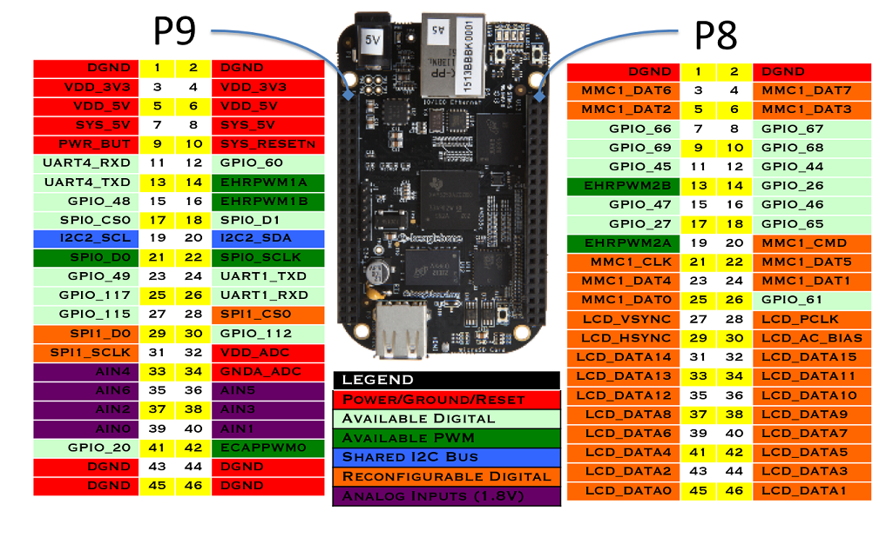
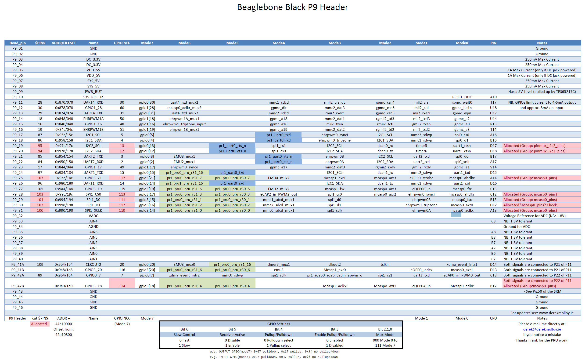

# GPIO Library Creation and System-Wide Installation Guide

This workshop will detail how to set up the BBB’s GPIO pins. General Purpose Input/Output (GPIO) pins are special in that they can be configured at runtime to perform in a variety of ways, ranging from simple i/o to serial interfaces to specialized encoder readings. While the BBB supports up the 69 gpio pins, in reality the majority of the pins are being used by onboard system processes such as the board’s HDMI and LCD abilities. This post will detail the steps necessary to take advantage of these otherwise inaccessible pins, as well as configure a gpio pin to suit the user’s needs.

This guide walks you through creating a simple GPIO library in C, compiling it into both a static and shared library, and installing it system-wide. We'll start with manual `gcc` commands and then automate the process using a `Makefile`.


## Linux Kernel Version
This guide assumes the user’s BBB is running Linux Kernel 4.1.15. If an earlier version is used, such as 3.8.X, then abundant information on configuring the BBB can be found through google and the procedures listed in this guide will probably not work.

## BBB Headers and Pinout
The BBB has two 23 pin columns on each side of the board, for a total of 92 pins available to the user. The right header is designated as P8 while the left is designated P9. Pay careful attention to the orientation of the BBB in reference to the pinout numbers, else you risk mis-wiring the board and potentially causing irreversible damage. Physical pins are numbered in the following manner, **PX_Y**, where **X** is the header where the pin is located (8 or 9) and **Y** is the location of the pin with that header. Pins `P8_1` and `P9_1` are located at the top right of each header. Notice that the left column of each header are all the odd pins while the right column of each header are all the even pins.

<div align=center>



</div>

As seen in the graphic, the first and last rows of pins are dedicated to nets such as **DGND**, **VDD_3V3** (3.3V Output), **VDD_5v** (5V Output), and system power/reset. The rest of the pins are configurable in software, as will be detailed later in this post. The labels on the graphic show the default mode of the pins. Not all pins are able to be used as GPIO’s immediately. Systems such as the LCD and HDMI drivers take priority to these pins. A more detailed view of the BBB’s header’s and pin usage can be seen in the graphics below




### GPIO Numbering Scheme

The gpio pins of the bbb are grouped into 3 groups of 32: _GPIO0_, _GPIO1_, and _GPIO2_. An individual pin can be refered to using the
convention `GPIOX_Y` where `X` is its gpio register and `Y` is its number within that register. _However, all references to a particular
pin made in software instead uses its absolute pin number!_ A gpio's _absolute_ pin number is calculated in the following manner: `Z =
32*X + Y` where `X` is again the gpio register and `Y` is the position within that register.

i.e. GPIO2\_24 is `32*2+24`, making it GPIO\_88. _If this pin were to be referenced anywhere in software, the user would use the number 88, not 24_!

### Overloaded Pins

Additional scrutiny of the above header pin layouts shows all the possible uses of each individual pin. Any pin highlighted in red is a pin that is inaccessible for use as a gpio pin by default, see the notes column for it's initial allocation. As an example, P8\_28, aka GPIO2\_24, aka GPIO\_88, is by default allocated to the `nxp_hdmi_bonelt_pins` group. While it is overloaded in this capacity,no other use can be made of this pin. Multiple modes are available for each pin, and setting these modes wil be discussed in a later section.

### Recap of Numbering Schemes

As a recap, _each gpio pin on the BBB has three different numbering schemes associated with it!_

1. The physical pin location, in the form of `PX_Y` (P8\_28)
2. The gpio name, in the form of `GPIOX_Y` (GPIO2\_24)
3. The gpio number, in the form of `32*X + Y` (88)

Only the last scheme, the gpio number, is used in software!

## Interacting with GPIO Pins on the BeagleBone Black (BBB) via Sysfs

The BeagleBone Black (BBB) and similar Linux-based systems allow you to interact with GPIO (General-Purpose Input/Output) pins using the sysfs interface. This interface exposes GPIO control via a set of files in the `/sys/class/gpio` directory. Below is an explanation of common GPIO operations using this interface.

### 1. Change Directory to GPIO Sysfs Interface

```bash
$ cd /sys/class/gpio
```
>**Explanation:**
>
>> - The `/sys` directory is a virtual filesystem (`sysfs`) that the Linux kernel uses to expose information and configuration options for various devices and drivers.
Within `/sys/class/gpio`, you'll find files and directories related to the GPIO subsystem, allowing you to interact with GPIO pins directly from the command line or within scripts.


Elevate user to super user.

```bash
$ sudo su
```

We interact with BBB pins via a set of files that are read/written to. To reach the directory where these files are located, enter the following.

```bash
$ cd /sys/class/gpio
```

List the directory.

```bash
$ ls -l
--w--w---- 1 root gpio 4.0K Apr  7 20:17 export
lrwxrwxrwx 1 root gpio    0 Apr  7 20:17 gpio10 -> ../../devices/platform/ocp/44e07000.gpio/gpiochip0/gpio/gpio10
lrwxrwxrwx 1 root gpio    0 Apr  7 20:17 gpio11 -> ../../devices/platform/ocp/44e07000.gpio/gpiochip0/gpio/gpio11
lrwxrwxrwx 1 root gpio    0 Apr  7 20:17 gpio110 -> ../../devices/platform/ocp/481ae000.gpio/gpiochip3/gpio/gpio110
lrwxrwxrwx 1 root gpio    0 Apr  7 20:17 gpio111 -> ../../devices/platform/ocp/481ae000.gpio/gpiochip3/gpio/gpio111
lrwxrwxrwx 1 root gpio    0 Apr  7 20:17 gpio112 -> ../../devices/platform/ocp/481ae000.gpio/gpiochip3/gpio/gpio112
...
--w--w---- 1 root gpio 4.0K Apr  7 20:17 unexport
```

```bash
$ cd gpio27
```

If you ls the directory you will see the following: 

```sh
$ ls
```

#### Understanding Files and Directories in the `gpio#` Directory

When working with GPIO (General-Purpose Input/Output) pins on a BeagleBone Black (BBB) or similar Linux-based systems, you'll encounter several files and directories within the `gpio#` directory located in `/sys/class/gpio/`. Each file or directory serves a specific purpose in controlling and configuring the GPIO pin. Here's what each one does:

**Files and Directories**

1. `active_low`
   - **Purpose:** Controls whether the logic level of the GPIO pin is inverted.
   - **Values:**
     - `0`: The default setting. A `0` in the `value` file corresponds to a low logic level (0V), and a `1` corresponds to a high logic level (3.3V or 5V, depending on the board).
     - `1`: Inverts the logic level. A `0` in the `value` file now corresponds to a high logic level, and a `1` corresponds to a low logic level.
   - **Usage:** Writing `1` to this file inverts the pin's logic, which can be useful when dealing with hardware that operates on inverted logic.

2. `device`
   - **Purpose:** A symbolic link to the device directory in sysfs that represents the GPIO controller to which this GPIO pin belongs.
   - **Details:** This link provides a path back to the parent device, helping to identify the specific GPIO controller that manages this pin, especially on systems with multiple GPIO controllers.

3. `direction`
   - **Purpose:** Configures the direction of the GPIO pin.
   - **Values:**
     - `in`: Configures the pin as an input, allowing you to read the state of the pin.
     - `out`: Configures the pin as an output, allowing you to set the state of the pin.
   - **Usage:** You can read or write to this file to change or check whether the GPIO pin is set as an input or output.

4. `edge`
   - **Purpose:** Configures the type of edge detection to trigger an interrupt for the GPIO pin.
   - **Values:**
     - `none`: No edge detection.
     - `rising`: Detects when the pin changes from low to high.
     - `falling`: Detects when the pin changes from high to low.
     - `both`: Detects both rising and falling edges.
   - **Usage:** Writing to this file sets the type of edge detection. It's often used in interrupt-driven applications where you need to respond to changes in the GPIO pin's state.

5. `label`
   - **Purpose:** Provides a label or identifier for the GPIO pin.
   - **Details:** This is usually set by the kernel or device tree and identifies the pin by name. It's helpful for debugging or when managing multiple GPIO pins.

6. `power`
   - **Purpose:** Provides power management controls for the GPIO pin.
   - **Details:** This directory typically contains files related to the power state of the GPIO pin, such as runtime power management options. These controls might be more relevant in complex power-managed systems.

7. `subsystem`
   - **Purpose:** A symbolic link to the subsystem the GPIO belongs to within sysfs.
   - **Details:** This link typically points back to `/sys/class/gpio/`, indicating that this GPIO pin is part of the GPIO subsystem. It's part of the hierarchical organization in sysfs.

8. `uevent`
   - **Purpose:** Provides information for udev, the device manager for the Linux kernel.
   - **Details:** This file is used by udev to manage dynamic device nodes and trigger events when the state of the GPIO changes. It's generally used internally by the system for device management.

9. `value`
   - **Purpose:** Reads or sets the current value of the GPIO pin.
   - **Values:**
     - `0`: Indicates a low state (0V) when reading, or sets the pin to a low state when writing.
     - `1`: Indicates a high state (3.3V or 5V) when reading, or sets the pin to a high state when writing.
   - **Usage:** This is the primary file used to interact with the GPIO pin. Reading from it returns the current state of the pin, and writing to it sets the pin's output level if the pin is configured as an output.


#### Set GPIO Pin 27 as an Output

This command sets the direction of GPIO pin 27 to output by writing out to the direction file.

```bash
echo out > direction
```

>**Explanation:**
>> - The direction file controls whether the GPIO pin is configured as an input or an output.
>>
>> - Writing `out` to this file configures the pin as an output, meaning you can set the pin's value (high or low) to control external devices (e.g., turning an LED on or off).
>>
>> - Alternatively, writing in would configure the pin as an input, allowing the pin to read signals from external devices.

#### Read the Current Value of GPIO Pin 27

This command sets GPIO pin 27 to a high state (1) by writing 1 to the value file.

```bash
$ echo 1 > value
```

> **Explanation:**
>> - The value file is used to control the state of a GPIO pin when it's configured as an output.
>>
>> - Writing `1` to this file sets the pin to a high state (e.g., 3.3V or 5V, depending on the board), which might turn on an LED or send a signal to another device.
>>
>> - Writing `0` would set the pin to a low state (0V), turning off the LED or signaling a low state to another device.

### Access using C library

The `gpio.h` library will be developed further below.

```c++
#include "gpio.h"
~~~
~~~
unsigned int pin = 14;
gpio_set_dir(pin,OUT);
gpio_set_value(pin,1);
```

## 2. Accessing Inaccessible Pins

Before going into the details of configuring inaccessible pins, it is
necessary to briefly go over the inner workings of the BBB and touch
on concepts such as pin modes, the device tree and its overlays, and
how to interact with it.

### Pin Modes

As seen in the above graphics detailing the P8 and P9 headers, each
pin can be configured to one out of 8 possible modes. For our
purposes, it is important to note that mode7 is always the GPIO
configuration for every pin. 

The pin mode for any given pin is stored in 7 bits using the following convention.


Notice the example configurations under the table. The bits values are
listed in Hexadecimal form, so that the two digits following "0x"
contain the values of all 7 bits. The last digit of the pair contains
the values of bits 0,1,2, and 3. As such, in order to be in mode7
(GPIO) bits 0,1, and 2 are all 1, giving a possible value of either 7
or F for the last hex digit. (Binary of either 0111 or 1111). The
first digit of the pair contains the values of bits 4,5, and 6 (with
the most significant bit being a constant 0). If the pin is configured
as an output, then the possible values of this bit are 0 and 1 (0000
and 0001) depending on if pull down or pull up is selected. If the pin
is an input, the possible values are 2 and 3 (0010 and 0011), again
depending on the pullup/down setting

The pin mode of each pin is configured in what is called a device tree
overlay, which will be discussed in detail in a later section.

## Step 1: Create the Header File (`gpio.h`)

1. First, create a header file that declares the functions and defines necessary constants and enums.

    <details>
    <summary>Code here...</summary>

    ```c
    #ifndef GPIO_H
    #define GPIO_H

    #define SYSFS_GPIO_DIR "/sys/class/gpio"
    #define POLL_TIMEOUT (3 * 1000) /* 3 seconds */
    #define MAX_BUF 64

    #define LED_DIR "/sys/class/leds/beaglebone:green:usr"

    typedef enum {
        INPUT_PIN = 0,
        OUTPUT_PIN = 1
    } PIN_DIRECTION;

    typedef enum {
        LOW = 0,
        HIGH = 1
    } PIN_VALUE;

    typedef struct {
        char pin_name[6];
        unsigned int gpio_number;
    } PinMap;

    // Static array to map pin names to GPIO numbers
    PinMap pin_map[] = {
        {"P8_31", 10}, {"P8_32", 11}, {"P9_31", 110}, {"P9_29", 111},
        {"P9_30", 112}, {"P9_28", 113}, {"P9_92", 114}, {"sysfs", 115},
        {"P9_91", 116}, {"P9_25", 117}, {"P9_20", 12}, {"P9_19", 13},
        {"P9_26", 14}, {"P9_24", 15}, {"A15", 19}, {"P9_22", 2},
        {"P9_41", 20}, {"P8_19", 22}, {"P8_13", 23}, {"P8_14", 26},
        {"P9_21", 3}, {"P9_11", 30}, {"P9_13", 31}, {"P8_25", 32},
        {"P8_24", 33}, {"P8_05", 34}, {"P8_06", 35}, {"P8_23", 36},
        {"P8_22", 37}, {"P8_03", 38}, {"P8_04", 39}, {"P9_18", 4},
        {"P8_12", 44}, {"P8_11", 45}, {"P8_16", 46}, {"P8_15", 47},
        {"P9_15", 48}, {"P9_23", 49}, {"P9_17", 5}, {"P9_14", 50},
        {"P9_16", 51}, {"P9_12", 60}, {"P8_26", 61}, {"P8_21", 62},
        {"P8_20", 63}, {"P8_18", 65}, {"P8_07", 66}, {"P8_08", 67},
        {"P8_10", 68}, {"P8_09", 69}, {"P9_42", 7}, {"P8_45", 70},
        {"P8_46", 71}, {"P8_43", 72}, {"P8_44", 73}, {"P8_41", 74},
        {"P8_42", 75}, {"P8_39", 76}, {"P8_40", 77}, {"P8_37", 78},
        {"P8_38", 79}, {"P8_35", 8}, {"P8_36", 80}, {"P8_34", 81},
        {"P8_27", 86}, {"P8_29", 87}, {"P8_28", 88}, {"P8_30", 89},
        {"P8_33", 9}, {"P8_27", 17}
    };

    // Function prototypes using pin names
    int find_gpio_number(const char *pin_name);
    int led_set_value(const char *pin_name, PIN_VALUE value);
    int gpio_set_dir(const char *pin_name, PIN_DIRECTION out_flag);
    int gpio_set_value(const char *pin_name, PIN_VALUE value);
    int gpio_get_value(const char *pin_name, unsigned int *value);
    int gpio_set_edge(const char *pin_name, const char *edge);
    int gpio_fd_open(const char *pin_name);
    int gpio_fd_close(int fd);

    #endif /* GPIO_H */
    ```

    </details>

## Step 3: Create the Implementation File (gpio.c)

2. Next, create the `gpio.c` file that implements the functions declared in `gpio.h`.

    <details>
    <summary>Code here... </summary>

    ```c
    #include "gpio.h"
    #include <stdio.h>
    #include <stdlib.h>
    #include <string.h>
    #include <errno.h>
    #include <unistd.h>
    #include <fcntl.h>
    #include <poll.h>

    
    // Function to find GPIO number from pin name
    int find_gpio_number(const char *pin_name) {
        for (int i = 0; i < sizeof(pin_map) / sizeof(PinMap); i++) {
            if (strcmp(pin_map[i].pin_name, pin_name) == 0) {
                return pin_map[i].gpio_number;
            }
        }
        return -1;  // Return -1 if the pin is not found
    }

    // GPIO functions using pin names directly

    int led_set_value(const char *pin_name, PIN_VALUE value) {
        unsigned int gpio = find_gpio_number(pin_name);
        if (gpio == -1) {
            fprintf(stderr, "Invalid pin name: %s\n", pin_name);
            return -1;
        }

        char buf[MAX_BUF];
        snprintf(buf, sizeof(buf), LED_DIR "%d/brightness", gpio);

        int fd = open(buf, O_WRONLY);
        if (fd < 0) {
            perror("led/set-value");
            return fd;
        }

        if (value == LOW) {
            write(fd, "0", 2);
        } else {
            write(fd, "1", 2);
        }

        close(fd);
        return 0;
    }

    int gpio_set_dir(const char *pin_name, PIN_DIRECTION out_flag) {
        unsigned int gpio = find_gpio_number(pin_name);
        if (gpio == -1) {
            fprintf(stderr, "Invalid pin name: %s\n", pin_name);
            return -1;
        }

        char buf[MAX_BUF];
        snprintf(buf, sizeof(buf), SYSFS_GPIO_DIR "/gpio%d/direction", gpio);

        int fd = open(buf, O_WRONLY);
        if (fd < 0) {
            perror("gpio/direction");
            return fd;
        }

        if (out_flag == OUTPUT_PIN) {
            write(fd, "out", 4);
        } else {
            write(fd, "in", 3);
        }

        close(fd);
        return 0;
    }

    int gpio_set_value(const char *pin_name, PIN_VALUE value) {
        unsigned int gpio = find_gpio_number(pin_name);
        if (gpio == -1) {
            fprintf(stderr, "Invalid pin name: %s\n", pin_name);
            return -1;
        }

        char buf[MAX_BUF];
        snprintf(buf, sizeof(buf), SYSFS_GPIO_DIR "/gpio%d/value", gpio);

        int fd = open(buf, O_WRONLY);
        if (fd < 0) {
            perror("gpio/set-value");
            return fd;
        }

        if (value == LOW) {
            write(fd, "0", 2);
        } else {
            write(fd, "1", 2);
        }

        close(fd);
        return 0;
    }

    int gpio_get_value(const char *pin_name, unsigned int *value) {
        unsigned int gpio = find_gpio_number(pin_name);
        if (gpio == -1) {
            fprintf(stderr, "Invalid pin name: %s\n", pin_name);
            return -1;
        }

        char buf[MAX_BUF];
        snprintf(buf, sizeof(buf), SYSFS_GPIO_DIR "/gpio%d/value", gpio);

        int fd = open(buf, O_RDONLY);
        if (fd < 0) {
            perror("gpio/get-value");
            return fd;
        }

        char ch;
        read(fd, &ch, 1);

        *value = (ch != '0') ? 1 : 0;

        close(fd);
        return 0;
    }

    int gpio_set_edge(const char *pin_name, const char *edge) {
        unsigned int gpio = find_gpio_number(pin_name);
        if (gpio == -1) {
            fprintf(stderr, "Invalid pin name: %s\n", pin_name);
            return -1;
        }

        char buf[MAX_BUF];
        snprintf(buf, sizeof(buf), SYSFS_GPIO_DIR "/gpio%d/edge", gpio);

        int fd = open(buf, O_WRONLY);
        if (fd < 0) {
            perror("gpio/set-edge");
            return fd;
        }

        write(fd, edge, strlen(edge) + 1);
        close(fd);
        return 0;
    }

    int gpio_fd_open(const char *pin_name) {
        unsigned int gpio = find_gpio_number(pin_name);
        if (gpio == -1) {
            fprintf(stderr, "Invalid pin name: %s\n", pin_name);
            return -1;
        }

        char buf[MAX_BUF];
        snprintf(buf, sizeof(buf), SYSFS_GPIO_DIR "/gpio%d/value", gpio);

        int fd = open(buf, O_RDONLY | O_NONBLOCK);
        if (fd < 0) {
            perror("gpio/fd_open");
        }
        return fd;
    }

    int gpio_fd_close(int fd) {
        return close(fd);
    }
    ```

## Step 4: Compile the Object File and Create Libraries

3. Compile gpio.c into an Object File by Using the following command to compile `gpio.c` into an object file (`gpio.o`):

    ```sh
    $ gcc -c gpio.c -o gpio.o
    ```

4. Create a Static Library (`libgpio.a`) to create a static library, use the `ar` command:

    ```sh
    $ ar rcs libgpio.a gpio.o
    ```

   - **Command Breakdown:**
     - `ar`: The archiver tool used to create and maintain library archives.
     - `rcs`: Flags where r inserts the files into the archive, c creates the archive if it doesn't exist, and s creates an index for quick symbol lookup.
     - `libgpio.a`: The name of the static library being created.
     - `gpio.o`: The object file to be included in the library.

    >> **Explanation: What is a Static Library?**
    >>
    >> A static library is a collection of object files that are linked into the final executable at compile time. Once linked, the code from the static library becomes part of the executable binary. This means that the executable will carry a copy of the library's code, making it self-contained and independent of the library file after compilation.

5. Create a Shared Library (`libgpio.so`) to create a shared library, use the following `gcc` command:

    ```sh
    $ gcc -shared -o libgpio.so gpio.o
    ```

    - **Command Breakdown:**
      - `-shared`: Tells gcc to produce a shared library.
      - `-o libgpio.so`: Specifies the output filename for the shared library.
      - `gpio.o`: The object file to be included in the library.

    >> **Explanation: What is a Shared Library?**
    >>
    >>A shared library, on the other hand, is not linked into the final executable at compile time. Instead, it is loaded into memory at runtime. Multiple programs can share a single copy of a shared library, which can save memory and allow updates to the library without recompiling the programs that use it.

## Step 5: Install the Header and Library Files System-Wide

6. You could manually copy the header file to `/usr/include` and the libraries to `/usr/lib`, or skip to the next section and create a `Makefile` to do it for you each time.

    ```sh
    $ sudo cp gpio.h /usr/include/
    $ sudo cp libgpio.a /usr/lib/
    $ sudo cp libgpio.so /usr/lib/
    $ sudo ldconfig  # Update the shared library cache
    ```

## Step 5: Automate with a Makefile

7. Instead of running these commands manually, you can automate the build process using a Makefile.

    <details>
    <summary>Code here... </summary>

    ```makefile
    # Variables
    CC = gcc
    CFLAGS = -Wall -Werror -fPIC  # -fPIC is needed for shared libraries
    AR = ar
    ARFLAGS = rcs
    TARGET_STATIC = libgpio.a
    TARGET_SHARED = libgpio.so
    OBJ = gpio.o

    # Default target: Build both libraries
    all: $(TARGET_STATIC) $(TARGET_SHARED)

    # Compile the gpio.c into an object file
    $(OBJ): gpio.c
        $(CC) $(CFLAGS) -c gpio.c -o $(OBJ)

    # Create the static library
    $(TARGET_STATIC): $(OBJ)
        $(AR) $(ARFLAGS) $(TARGET_STATIC) $(OBJ)

    # Create the shared library
    $(TARGET_SHARED): $(OBJ)
        $(CC) -shared -o $(TARGET_SHARED) $(OBJ)

    # Clean up build artifacts
    clean:
        rm -f $(OBJ) $(TARGET_STATIC) $(TARGET_SHARED)

    # Install libraries and header
    install: $(TARGET_STATIC) $(TARGET_SHARED)
        sudo cp gpio.h /usr/include/
        sudo cp $(TARGET_STATIC) /usr/lib/
        sudo cp $(TARGET_SHARED) /usr/lib/
        sudo ldconfig

    # Uninstall libraries and header
    uninstall:
        sudo rm -f /usr/include/gpio.h
        sudo rm -f /usr/lib/$(TARGET_STATIC)
        sudo rm -f /usr/lib/$(TARGET_SHARED)
        sudo ldconfig

    # Phony targets
    .PHONY: all clean install uninstall
    ```

    </details>

8. As long as the Makefile is within directory with the custom gpio c files you can use the `make` command:
   
   -  Remove `gpio.h`, and static and share libraries from the respective directories

        ```sh
        $ make uninstall
        ```

   - To clean up the build artefacts run: 
    
        ```sh
        $ make clean
        ```
   - To build the libraries and object files:

        ```sh
        $ make all
        ```

   - Lastly, use the install command to cp libraries and header to respective root directories:

        ```sh
        $ make install
        > gcc -Wall -Werror -fPIC   -c gpio.c -o gpio.o
          ar rcs libgpio.a gpio.o
          gcc -shared -o libgpio.so gpio.o
        ```
## Step 6: Using the our new libary to control a pin

9. Change directory and `../` and make a new directory called `blink` and navigate into it.
    
    ```sh
    $ cd ../
    $ mkdir blink
    $ cd blink
    ```

10. Create a new .c file called... `blink.c` and chose your preferred editor to open it.
    ```sh
    $ touch blink.c
    $ vim blink.c
    ```

11. Now we are going to set up the program to use our system wide library and header with `gpio.h`:
    
    <details>
    <summary>Code here... </summary>

    ```c
    #include <stdio.h>
    #include <unistd.h>
    #include "gpio.h"

    int main() {
        const char *pin_name = "P9_30";  // Use the pin name directly

        // Set the GPIO direction to output
        gpio_set_dir(pin_name, OUTPUT_PIN);

        while(1){
            // Set the GPIO pin value to HIGH (turn on the LED)
            gpio_set_value(pin_name, HIGH);
            printf("LED on %s is ON\n", pin_name);

            // Wait for a few seconds
            sleep(3);

            // Set the GPIO pin value to LOW (turn off the LED)
            gpio_set_value(pin_name, LOW);
            printf("LED on %s is OFF\n", pin_name);
            sleep(3);
        }
        return 0;
    }
    ```

    </details>

12. We can use this oneliner to compile the code:

    ```sh
    $ gcc 
    ```

13. Alternatively we can use a `Makefile` like before:

    <details>
    <summary>Code here... </summary>

    ```makefile
    # Compiler and flags
    CC = gcc
    CFLAGS = -Wall -Werror

    # Target executable name
    TARGET = blink

    # Source files
    SRC = blink.c

    # Library to link against
    LIBS = -lgpio

    # Default target: build the executable
    all: $(TARGET)

    # Build the executable
    $(TARGET): $(SRC)
            $(CC) $(CFLAGS) $(SRC) $(LIBS) -o $(TARGET)

    # Clean up build artifacts
    clean:
            rm -f $(TARGET)

    # Phony targets to avoid conflicts with files of the same name
    .PHONY: all clean
    ```
    
    Invoke make to build the executable:

    ```sh
    $ make
    ```

    </details>

14. Use the led and etc to wire up and run the code:

    ```sh
    $ ./blink
    ```

    - If all is well, and you have connected up your led to the correct pin, the light should turn on and then off.
