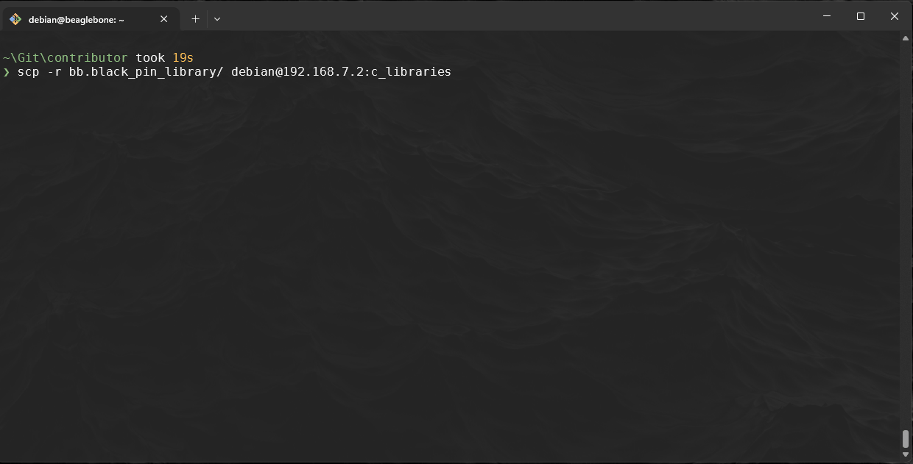

# libioctrl

~~~admonish warning

- Make sure you have completed the following chapters: 
   - [GPIO Library](../GPIOLibrary/GPIOLibrary.md)
   - [ADC Library](../ADCLibrary/ADCLibrary.md)
   - [PWM Library](../PWMLibrary/PWMLibrary.md)

~~~

In this chapter we are going to combine our previous source code into a centeralised directory.

## 1. Setting up the `libioctrl` source code:

1. Create a new directory in home called `libioctrl`:

    ~~~admonish terminal

    ```sh
    $ mkdir -p ~/libioctrl/{src, include}
    ```
    ~~~

2. We need to copy the `adc.{c/h}` , `gpio.{c/h}` and `pwm.{c/h}` from the respective directories into two new child directories inside of `libioctrl`, `src` and `include`:

    ~~~admonish terminal title='Terminal: Example'

    ```sh
    $ cp adc/adc.c ~/libioctrl/src && cp adc/adc.h ~/libioctrl/include
    ```

    ~~~
    
    Repeat for each of the other libraries we had made earlier. 

3. You should have the following structure: 

    ~~~admonish output

    ```
    $ ls -l ~/libioctrl/*
    libioctrl/include:
    total 12
    -rw-r--r-- 1 debian debian  685 Apr 14 19:25 adc.h
    -rw-r--r-- 1 debian debian 2557 Apr 14 20:35 gpio.h
    -rw-r--r-- 1 debian debian 1636 Apr 14 20:35 pwm.h

    libioctrl/src:
    total 12
    -rw-r--r-- 1 debian debian 1288 Apr 14 19:24 adc.c
    -rw-r--r-- 1 debian debian 3559 Apr 14 19:46 gpio.c
    -rw-r--r-- 1 debian debian 2490 Apr 14 19:24 pwm.c
    ```

    ~~~

4. Now make a new `libioctrl.h` inside the `include/` and fill the following:

    ~~~admonish code title='Code: `include/libioctrl.h`'

    ```h
    #ifndef LIBIOCTRL_H
    #define LIBIOCTRL_H

    #include "gpio.h"
    #include "pwm.h"
    #include "adc.h"

    #endif // LIBIOCTRL_H
    ```

    ~~~

5. Replace the `#include "adc.h"`, `#include "gpio.h"` and `#include "pwm.h"` inside the respective `.c` files:

    ~~~admonish code title='Code:   `src/adc.c`'
    
    ```c
    # include "../include/adc.h"
    ```
    
    ~~~

    Repeat for the other `.c` files

 6. Next we need to update some variable names to deal with the issue of multiple declarations when compiling. Inside `include/pwm.h` change the following, we are only appending `PWM` to `PinMap`:

    Old:

    ~~~admonish code collapsible=true title='Suppressed code [15 lines]...'

    ```h
    // Structure to hold PWM mapping information
    typedef struct {
        char physical_pin[10];  // Physical pin on the BeagleBone Black (e.g., "P9_16")
        char pwm_chip_channel[10]; // PWM chip and channel (e.g., "4:1")
    } PinMap;
    ...
    // Define the pin_map array with physical pins and their corresponding PWM chip:channel
    PinMap phy_pin_map[] = {
        {"P9_16", "4:1"},  // eHRPWM1B
        {"P9_14", "4:0"},  // eHRPWM1A
        {"P9_21", "1:1"},  // eHRPWM0B
        {"P9_22", "1:0"},  // eHRPWM0A
        {"P8_13", "7:1"},  // eHRPWM2B
        {"P8_19", "7:0"},  // eHRPWM2A
        {"P9_28", "3:0"},  // eCAP1
        {"P9_42", "0:0"}  // eCAP0
    };

    ```
    ~~~

    New:

    ~~~admonish code collapsible=true title='Suppressed code [15 lines]...'

    ```h
    // Structure to hold PWM mapping information
    typedef struct {
        char physical_pin[10];  // Physical pin on the BeagleBone Black (e.g., "P9_16")
        char pwm_chip_channel[10]; // PWM chip and channel (e.g., "4:1")
    } PWMPinMap;
    ...
    // Define the pin_map array with physical pins and their corresponding PWM chip:channel
    PWMPinMap phy_pin_map[] = {
        {"P9_16", "4:1"},  // eHRPWM1B
        {"P9_14", "4:0"},  // eHRPWM1A
        {"P9_21", "1:1"},  // eHRPWM0B
        {"P9_22", "1:0"},  // eHRPWM0A
        {"P8_13", "7:1"},  // eHRPWM2B
        {"P8_19", "7:0"},  // eHRPWM2A
        {"P9_28", "3:0"},  // eCAP1
        {"P9_42", "0:0"}  // eCAP0
    };
    ```
    ~~~

    Update the `src/pwm.c` to reference the `PWMPinMap` inside `sizeof(...)`:

    ~~~admonish code
    
    ```c
    for (int i = 0; i < sizeof(phy_pin_map) / sizeof(PWMPinMap); i++) {
        if (strcmp(phy_pin_map[i].physical_pin, pin_name) == 0) {
            // Parse the pwmchip and pwm channel
            sscanf(phy_pin_map[i].pwm_chip_channel, "%[^:]:%s", pwm_channel, pwm_chip);
        }
    }
    ```
    
    ~~~

7. Next we need to update some variable names to deal with the issue of multiple declarations when compiling. Inside `include/gpio.h` change the following, we are only appending `GPIO` to `PinMap` and `gpio_` to `pin_map`:

    Old

    ~~~admonish code collapsible=true title='Suppressed code [10 lines]...'

    ```h
    // Define a simple mapping array for P8 and P9 pin names to GPIO numbers
    typedef struct {
        char pin_name[6];
        unsigned int gpio_number;
    } PinMap;
    ...
    // Static array to map pin names to GPIO numbers
    PinMap gpio_pin_map[] = {
        {"P8_31", 10}, {"P8_32", 11}, {"P9_31", 110}, {"P9_29", 111},
        ...
    }
    ```
    
    ~~~

    New

    ~~~admonish code collapsible=true title='Suppressed code [15 lines]...'

    ```h
    // Define a simple mapping array for P8 and P9 pin names to GPIO numbers
    typedef struct {
        char pin_name[6];
        unsigned int gpio_number;
    } GPIOPinMap;
    ...
    // Static array to map pin names to GPIO numbers
    GPIOPinMap gpio_pin_map[] = {
        {"P8_31", 10}, {"P8_32", 11}, {"P9_31", 110}, {"P9_29", 111},
        ...
    }
    ```

    ~~~

    Update the `src/gpio.c` to reference the `gpio_pin_map` and `GPIOPinMap` inside `sizeof(...)`, remember to replace all the instances of `pin_map` in the below function to `gpio_pin_map`:

    ~~~admonish code

    ```c
    // Function to find GPIO number from pin name
    int find_gpio_number(const char *pin_name) {
        for (int i = 0; i < sizeof(gpio_pin_map) / sizeof(GPIOPinMap); i++) {
            if (strcmp(gpio_pin_map[i].pin_name, pin_name) == 0) {
                return gpio_pin_map[i].gpio_number;
            }
        }
        return -1;  // Return -1 if the pin is not found
    }
    ```

    ~~~

## 2: Make with a Makefile

~~~admonish warning

- Before running make for `libioctrl`, we should remove all current libaries from before. For each original library, `adclib`, `gpiolib`, `pwmlib` or whether you made them run `make uninstall` and `make clean` in each one: 

    

~~~

8. Build a Makefile and fill with the following:

    ~~~admonish code collapsible=true title='Suppressed code [55 lines]...'

    ```makefile
    # Compiler and flags
    CC = gcc
    CFLAGS = -Wall -Werror -fPIC -I./include  # Include headers
    AR = ar
    ARFLAGS = rcs
    PREFIX = /usr
    INCLUDEDIR = $(PREFIX)/include
    LIBDIR = $(PREFIX)/lib

    # Directories
    SRCDIR = ./src
    OBJDIR = ./obj

    # Library names
    TARGET_STATIC = libioctrl.a
    TARGET_SHARED = libioctrl.so

    # Source files for each component
    SRC = $(SRCDIR)/gpio.c $(SRCDIR)/pwm.c $(SRCDIR)/adc.c
    OBJ = $(patsubst $(SRCDIR)/%.c, $(OBJDIR)/%.o, $(SRC))

    # Default target: Build both libraries
    all: $(TARGET_STATIC) $(TARGET_SHARED)

    # Compile source files into object files
    $(OBJDIR)/%.o: $(SRCDIR)/%.c
            @mkdir -p $(OBJDIR)
            $(CC) $(CFLAGS) -c $< -o $@

    # Create the static library
    $(TARGET_STATIC): $(OBJ)
            $(AR) $(ARFLAGS) $@ $(OBJ)

    # Create the shared library
    $(TARGET_SHARED): $(OBJ)
            $(CC) -shared -o $@ $(OBJ)

    # Clean up build artifacts
    clean:
            rm -rf $(OBJDIR) $(TARGET_STATIC) $(TARGET_SHARED)

    # Install libraries and headers
    install: $(TARGET_STATIC) $(TARGET_SHARED)
            sudo cp include/gpio.h include/pwm.h include/adc.h include/libioctrl.h $(INCLUDEDIR)/
            sudo cp $(TARGET_STATIC) $(TARGET_SHARED) $(LIBDIR)/
            sudo ldconfig

    # Uninstall libraries and headers
    uninstall:
            sudo rm -f $(INCLUDEDIR)/gpio.h $(INCLUDEDIR)/pwm.h $(INCLUDEDIR)/adc.h $(INCLUDEDIR)/libioctrl.h
            sudo rm -f $(LIBDIR)/$(TARGET_STATIC) $(LIBDIR)/$(TARGET_SHARED) $(OBJDIR)
            sudo ldconfig

    # Phony targets
    .PHONY: all clean install uninstall
    ```

    ~~~
    
9. We need to remove all reference to libraries created before, navigate to `adc`, `gpio` and `pwm` directories and run: 
    
    ~~~admonish terminal
    
    ```sh
    path/to/adc$ make uninstall
    ...
    ```

    ~~~

10. Go back to the `libioctrl` and run `make`:

    ~~~admonish output

    ```sh
    path/to/libioctrl$ make install
    gcc -Wall -Werror -fPIC -I./include   -c src/gpio.c -o obj/gpio.o
    gcc -Wall -Werror -fPIC -I./include   -c src/pwm.c -o obj/pwm.o
    gcc -Wall -Werror -fPIC -I./include   -c src/adc.c -o obj/adc.o
    ar rcs libioctrl.a  ./obj/gpio.o  ./obj/pwm.o  ./obj/adc.o
    gcc -shared -o libioctrl.so  ./obj/gpio.o  ./obj/pwm.o  ./obj/adc.o
    sudo cp include/gpio.h include/pwm.h include/adc.h include/libioctrl.h /usr/include/
    sudo cp libioctrl.a libioctrl.so /usr/lib/
    sudo ldconfig
    ...
    ```
    
    ~~~

11. Breaking down the output of `make install`:

    **Object file compilation**:

    - The `gcc` command is compiling each source file (`src/gpio.c`, `src/pwm.c`, and `src/adc.c`) into object files (`obj/gpio.o`, `obj/pwm.o`, and `obj/adc.o`), and it uses the appropriate flags (`-Wall`, `-Werror`, `-fPIC`, `-I./include`).

        ~~~admonish terminal

        ```
        gcc -Wall -Werror -fPIC -I./include   -c src/gpio.c -o obj/gpio.o
        gcc -Wall -Werror -fPIC -I./include   -c src/pwm.c -o obj/pwm.o
        gcc -Wall -Werror -fPIC -I./include   -c src/adc.c -o obj/adc.o
        ```

        ~~~

    **Creating the static library**:

    - The `ar rcs` command is creating the static library `libioctrl.a` by combining the compiled object files `gpio.o`, `pwm.o`, and `adc.o`.

        ~~~admonish terminal

        ```
        ar rcs libioctrl.a  ./obj/gpio.o  ./obj/pwm.o  ./obj/adc.o
        ```

        ~~~

    **Creating the shared library**:

    - The `gcc -shared` command is creating the shared library `libioctrl.so` by linking the same object files `gpio.o`, `pwm.o`, and `adc.o`
        ~~~admonish terminal

        ```
        gcc -shared -o libioctrl.so  ./obj/gpio.o  ./obj/pwm.o  ./obj/adc.o
        ```

        ~~~

    **System wide availability**:

    - This command copies the header files (`gpio.h`, `pwm.h`, `adc.h`, and `libioctrl.h`) to the system's `/usr/include/` directory. This makes the header files available system-wide, allowing programs to include these headers when building applications that use the library.

        ~~~admonish terminal

        ```
        sudo cp include/gpio.h include/pwm.h include/adc.h include/libioctrl.h /usr/include/
        ```

        ~~~

    - This command copies the static (`libioctrl.a`) and shared (`libioctrl.so`) versions of the libioctrl library to `/usr/lib/`, which is a standard system library directory. This allows programs to link against the library when building.

        ~~~admonish terminal

        ```
        sudo cp libioctrl.a libioctrl.so /usr/lib/:
        ```

        ~~~

    - This command updates the system's dynamic linker cache. It ensures that the system is aware of the newly installed shared libraries (e.g., libioctrl.so) so that applications can find and use the shared library at runtime

        ~~~admonish output

        ```
        sudo ldconfig
        ```
         
        
        
        ~~~

## Using our new library

12. Update any of the following tests we ran before; `adc2pwm.c`, `adc_continous_read`, `adc_read`, `blink` and `pwm_test`:

    In this example I will update the `adc_read.c` headers and part of the `Makefile`:

    `adc_read.c`
    
    ~~~admonish code

    ```c
    #include "libioctrl.h" # originally adc.h
    #include <stdio.h>
    #include <unistd.h>
    ...
    ``` 
    
    ~~~

    `Makefile`
    
    ~~~admonish code


    ```makefile
    ...
    # Library to link against
    LIBS = -lioctrl # originally, ladc
    ...
    ```

    ~~~

    You should repeat for the others, and remember to `make clean` before running `make` for each of these programs to remove original exe.

## Fork and Clone `Libioctrl` library

13. Incase it doesn't work as intended, you can download the `libioctrl` library from GitHub: [CompEng0001/bb.black_pin_library](https://github.com/CompEng0001/bb.black_pin_library/fork)

14. Clone the forked repo: `git clone git@github.com:YOURUSERNAME/bb.black_pin_library`

15. `cd` to the parent directory of where you cloned the repo using shell copy command, `scp`: 

    ~~~admonish terminal
    
    ```sh
    scp -r /path/to/bb.black_pin_library debian@192.168.7.2:c_libraries
    ```
    
    ~~~
    
    

16. You should then be able to install the library via the `bash install.sh` script within the repo:


    