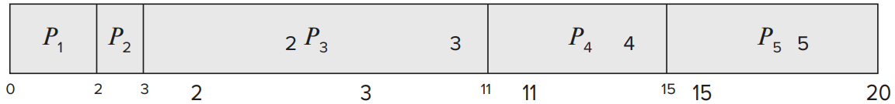

# Scheduling

This lab will look at various scheduling algorithms.

-------------

## 0. Lecture Material

Download this file and do the little exercise within: 
- [scheduling.xlsx](./excel/scheduling.xlsx)

--------------

## 1. 10 Exercises on CPU scheduling

### 1.1 
A CPU-scheduling algorithm determines an order for the execution of its scheduled processes. Given \\(n\\) processes to be scheduled on one processor, how many different schedules are possible? Give a formula in terms of \\(n\\).

<details>
<summary>Answer</summary>

\\[n! (n factorial = n × n – 1 × n – 2 × ... × 2 × 1).\\]

</details>

### 1.2 

Explain the difference between preemptive and nonpreemptive scheduling

<details>
<summary>Answers</summary>

- Preemptive scheduling allows a process to be interrupted in the midst of its execution, taking the CPU away and allocating it to another process. 

- Nonpreemptive scheduling ensures that a process relinquishes control of the CPU only when it nishes with its current CPU burst

</details>

### 1.3 

Suppose that the following processes arrive for execution at the times indicated. Each process will run for the amount of time listed. 

>**Note**: 
>> In answering the questions, use nonpreemptive scheduling, and base all decisions on the information you have at the time the decision must be made:


|Process| Arrival Time| Burst Time|
|:---:|:---:|:---:|
|P<sub>1</sub>|0.0 |8|
|P<sub>2</sub>| 0.4 |4|
|P<sub>3</sub>| 1.0 |1|


>**Note**:
>> Remember that turnaround time is finishing time minus arrival time, so you have to subtract the arrival times to compute the turnaround times. FCFS is 11 if you forget to subtract arrival time

1. What is the average turnaround time for these processes with the FCFS scheduling algorithm?

    <details>
    <summary>Answer</summary>

    10.53

    </details>

2. What is the average turnaround time for these processes with the SJF scheduling algorithm?

    <details>
    <summary>Answer</summary>

    9.53

    </details>

3. The SJF algorithm is supposed to improve performance, but notice that we chose to run process P<sub>1</sub> at time 0 because we did not know that two shorter processes would arrive soon. 
Compute what the average turnaround time will be if the CPU is left idle for the first 1 unit and then SJF scheduling is used. Remember that processes P<sub>1</sub> and P<sub>2</sub> are waiting during this idle time, so their waiting time may increase. This algorithm could be known as future-knowledge scheduling.


    <details>
    <summary>Answer</summary>

    6.86

    </details>


### 1.4

Consider the following set of processes, with the length of the CPU burst time given in milliseconds:

|Process |Burst Time|Priority|
|:---:|:---:|:---:|
|P<sub>1</sub>|2 |2|
|P<sub>2</sub>| 1 |1|
|P<sub>3</sub>| 8 |4|
|P<sub>4</sub>|4 |2|
|P<sub>5</sub>| 5 |3|


The processes are assumed to have arrived in the order P<sub>1</sub>, P<sub>2</sub>, P<sub>3</sub>, P<sub>4</sub>, P<sub>5</sub> all at time 0

1. Draw four Gantt charts that illustrate the execution of these processes using the following scheduling algorithms: FCFS, SJF, nonpreemptive priority (a larger priority number implies a higher priority), and RR (quantum = 2).

    <details>
    <summary>Answers</summary>

    FCFS
    


    SJF
    


    Non-Premeptive Priority
    


    FCFS
    

    </details>

2. What is the turnaround time of each process for each of the scheduling algorithms in part a?


<details>
    <summary>Answers</summary>


||FCFS| SJF| Priority| RR|
|:---:|:---:|:---:|:---:|:---:|
|P<sub>1</sub>|2| 3| 15| 2|
|P<sub>2</sub>|3 |1| 20| 3|
|P<sub>3</sub>|11 |20| 8| 20|
|P<sub>4</sub>| 15 |7 |19 |13|
|P<sub>5</sub>| 20 |12| 13| 18|

</details>

3. What is the waiting time of each process for each of these scheduling algorithms?

<details>
    <summary>Answers</summary>


||FCFS| SJF| Priority| RR|
|:---:|:---:|:---:|:---:|:---:|
|P<sub>1</sub>|0| 1| 13| 0|
|P<sub>2</sub>|2 |0| 19| 2|
|P<sub>3</sub>|3 |12| 0| 12|
|P<sub>4</sub>| 11 |3 |15 |9|
|P<sub>5</sub>| 15 |7| 8| 12|

</details>


4. Which of the algorithms results in the minimum average waiting time (over all processes)

    <details>
    <summary>Answer</summary>

    SJF has the shortest wait time
    </details>

### 1.5 

The following processes are being scheduled using a preemptive, roundrobin scheduling algorithm.

|Process|Priority| Burst| Arrival|
|:---:|:---:|:---:|:---:|
|P<sub>1</sub>|40| 20| 0| 
|P<sub>2</sub>|30 |25| 25| 
|P<sub>3</sub>|30 |25| 30| 
|P<sub>4</sub>| 35 |15 |60|
|P<sub>5</sub>| 5 |10| 100|
|P<sub>5</sub>| 10 |10| 105|


Each process is assigned a numerical priority, with a higher number indicating a higher relative priority. In addition to the processes listed above, the system also has an **idle task** (which consumes no CPU resources and is identied as P<sub>idle</sub>). This task has priority 0 and is scheduled whenever the system has no other available processes to run. The length of a time quantum is 10 units. If a process is preempted by a higher-priority process, the preempted process is placed at the end of the queue


1. Show the scheduling order of the processes using a Gantt chart.

    <details>
    <summary>Answers</summary>

    

    </details>

2. What is the turnaround time for each process?

    <details>
    <summary>Answers</summary>

    - P1: 20 - 0 = 20
    - P2: 80 - 25 = 55
    - P3: 90 - 30 = 60
    - P4: 75 - 60 = 15
    - P5:120 - 100 = 20
    - P6: 115 - 105 = 10

    </details>

3. What is the waiting time for each process?

    <details>
    <summary>Answers</summary>

    - P1: 0
    - P2: 40
    - P3: 35
    - P4: 0
    - P5: 10
    - P6: 0
 
    </details>  

4. What is the CPU utilization rate?

    <details>
    <summary>Answer</summary>

    105/120 = 87.5 percen

    </details>

### 1.6

What advantage is there in having different time-quantum sizes at different levels of a multilevel queueing system?

<details>
<summary>Answer</summary>

Processes that need more frequent servicing for instance, interactive processes such as editors can be in a queue with a small time quantum. Processes with no need for frequent servicing can be in a queue with a larger quantum, requiring fewer context switches to complete the processing and thus making more efcient use of the compute

</details>


### 1.7

Many CPU-scheduling algorithms are parameterized. For example, the RR algorithm requires a parameter to indicate the time slice. Multilevel feedback queues require parameters to dene the number of queues, the scheduling algorithms for each queue, the criteria used to move processes between queues, and so on.

These algorithms are thus really sets of algorithms (for example, the set of RR algorithms for all time slices, and so on). One set of algorithms may include another (for example, the FCFS algorithm is the RR algorithm  with an innite time quantum). What (if any) relation holds between the following pairs of algorithm sets?

1. Priority and SJF

    <details>
    <summary>Answers</summary>

    The shortest job has the highest priority

    </details>

2. Multilevel feedback queues and FCFS

    <details>
    <summary>Answers</summary>

    The lowest level of MLFQ is FCFS.

    </details>

3. Priority and FCFS

    <details>
    <summary>Answers</summary>

    FCFS gives the highest priority to the job that has been in existence the longest.

    </details>

4. RR and SJF

    <details>
    <summary>Answers</summary>

    None.

    </details> 


### 1.8

Suppose that a CPU scheduling algorithm favors those processes that have used the least processor time in the recent past. Why will this algorithm favor I/O-bound programs and yet not permanently starve CPU-bound programs?

<details>
<summary>Answers</summary>

It will favor the I/O-bound programs because of the relatively short CPU bursts requested by them; however, the CPU-bound programs will not starve, because the I/O-bound programs will relinquish the CPU relatively often to do their I/O.

</details>

### 1.9

Distinguish between PCS and SCS scheduling.

<details>
<summary>Answers</summary>

- PCS scheduling is local to the process. It is how the thread library schedules threads onto available LWPs. 

- SCS scheduling is used when the operating system schedules kernel threads. 

- On systems using either the many-to-one or the many-to-many model, the two scheduling models are fundamentally different. On systems using the one-to-one model, PCS and SCS are the same.

</details>

### 1.10

The traditional UNIX scheduler enforces an inverse relationship between priority numbers and priorities: the higher the number, the lower the priority. The scheduler recalculates process priorities once per second using the following function:

\\[Priority = (\frac{recent CPU usage}{2}) + base\\]

Where:
- \\(base = 60\\)
- \\(recent CPU usage\\) refers to a value indicating how often a process has used the CPU since priorities were last recalculated.

Assume that recent CPU usage for process P<sub>1</sub> is 40, for process P<sub>2</sub> is 18, and for process P<sub>3</sub>
is 10. 

What will be the new priorities for these three
processes when priorities are recalculated? Based on this information, does the traditional UNIX scheduler raise or lower the relative priority of a CPU-bound process?

<details>
<summary>Answer</summary>

The priorities assigned to the processes will be 80, 69, and 65, respectively. The scheduler lowers the relative priority of CPU-bound processes.

</details>

-----------------

## 2 Writing the algorithms in C.

### 2.1 First Come First Servce

Write a C program to implement the First-Come, First-Serve (FCFS) scheduling algorithm. The program should perform the following steps:

1. First build a header file called, `schedulingAlgorithms.h`

2. Define and implement the `findWaitingTime()`, `findTurnAroundTime()`, and `findAverageTime()` functions as shown in the code provided.


    ```c
    // function to find the waiting time for all processes
    void findWaitingTime(int processes[], int n, int bt[], int wt[])
    {
        // waiting time for first process will be 0
        wt[0] = 0;

        // calculating waiting time
        for (int i = 1; i < n ; i++)
        {
            wt[i] =  bt[i-1] + wt[i-1];
        }
    }

    // function to calculate turn around time
    void findTurnAroundTime( int processes[], int n, int bt[], int wt[], int tat[])
    {
        // calculating turnaround time by adding
        // bt[i] + wt[i]
        for (int i = 0; i < n ; i++)
        {
            tat[i] = bt[i] + wt[i];
        }
    }

    // function to calculate average time
    void findAverageTime( int processes[], int n, int bt[])
    {
        int wt[n], tat[n], total_wt = 0, total_tat = 0;

        // function to find waiting time of all processes
        findWaitingTime(processes, n, bt, wt);

        // function to find turn around time for all processes
        findTurnAroundTime(processes, n, bt, wt, tat);

        // display processes along with all details
        printf("Processes  Burst time  Waiting time  Turn around time\n");

        // calculate total waiting time and total turn around time
        for (int i = 0; i < n; i++)
        {
            total_wt = total_wt + wt[i];
            total_tat = total_tat + tat[i];
            printf("   %d\t\t%d\t    %d\t\t  %d\n", i+1, bt[i], wt[i], tat[i]);
        }

        printf("Average waiting time = %f\n", (float)total_wt / (float)n);
        printf("Average turn around time = %f\n", (float)total_tat / (float)n);
    }

    ```

3. Include the necessary header files at the beginning of the program:

    ```c
    #include <stdio.h>
    #include "schedulingAlgorithms.h"
    ```

4. In the `main()` function, declare and initialise the `processes[]` array with process IDs `{1, 2, 3, 4}` and the `burst_time[]` array with burst times `{21, 3, 6, 2}`.

    ```c
    // main function
    int main()
    {
        // process ids
        int processes[] = { 1, 2, 3, 4};
        int n = sizeof processes / sizeof processes[0];

        // burst time of all processes
        int  burst_time[] = {21, 3, 6, 2};

        findAverageTime(processes, n,  burst_time);

        return 0;
    }

    ```


4. Compile the code using a C compiler.

    ```sh
    $ gcc fcfs.c -o fcfs
    ```

5. Run the compiled executable to see the output, which should display the processes, their burst times, waiting times, turn-around times, and the average waiting time and average turn-around time.

    <details>
    <summary>Output</summary>

    ```sh
    > fcfs
    Processes	Burst time	Waiting time	Turn around time
    1		21		0		21
    2		3		21		24
    3		6		24		30
    4		2		30		32
    Average waiting time = 18.75
    Average turn around time = 26.75
    ```

    </details>

6. Verify that the output matches the expected results.

7. Modify this script for user input... 


    <details>
    <summary>Solution</summary>

    ```c
    #include <stdio.h>
    #include "schedulingAlgorithms.h"
    // main function
    int main()
    {
        int n; // number of processes
        printf("Enter the number of processes: ");
        scanf("%d", &n);

        int processes[n]; // array to store process IDs
        int burst_time[n]; // array to store burst times

        // taking user input for burst times
        printf("Enter burst times for %d processes:\n", n);
        for (int i = 0; i < n; i++)
        {
            printf("Burst time for process %d: ", i + 1);
            scanf("%d", &burst_time[i]);
            processes[i] = i + 1;
        }

        findAverageTime(processes, n, burst_time);

        return 0;
    }


    ```

    </details>

## 2.2 Round Robin in C

1. Modify the `schedulingAlgorithms.h` to include the following at the bottom of the header file:

    ```c

    // Function to find the waiting time for all processes 
    void findRRWaitingTime(int processes[], int n, int bt[], int wt[], int quantum) 
    { 
        // Let us Make a copy of burst times bt[] to store remaining burst times
        int rem_bt[n]; 
        for (int i = 0 ; i < n ; i++) 
            rem_bt[i] = bt[i]; 

        int t = 0; // for Current time 

        // Let us keep traverse the processes in the round robin manner until all of them are not done.
        while (1) 
        { 
            int done = 1; 

            //let us Traverse all processes one by one repeatedly 
            for (int i = 0 ; i < n; i++) 
            { 
                // If burst time of a process is greater than 0 then there is a need to process further
                if (rem_bt[i] > 0) 
                { 
                    done = 0; // indicates there is a pending process 

                    if (rem_bt[i] > quantum) 
                    { 
                        // By Increasing the value of t it shows how much time a process has been processed 
                        t += quantum; 

                        // Decreasing the burst_time of current process by the quantum
                        rem_bt[i] -= quantum; 
                    } 

                    // If burst time is smaller than or equal to the quantum then it is Last cycle for this process 
                    else
                    { 
                        // Increase the value of t to show how much time a process has been processed 
                        t = t + rem_bt[i]; 

                        // Waiting time is current time minus time used by this process.
                        wt[i] = t - bt[i]; 

                        // As the process gets fully executed thus remaining burst time becomes 0.
                        rem_bt[i] = 0; 
                    } 
                } 
            } 

            // If all the processes are done 
            if (done == 1) 
                break; 
        } 
    } 

    // Function to calculate the average time 
    void findRRavgTime(int processes[], int n, int bt[], int quantum) 
    { 
        int wt[n], tat[n], total_wt = 0, total_tat = 0; 

        // Function to find waiting time of all processes 
        findRRWaitingTime(processes, n, bt, wt, quantum); 

        // Function to find turn around time for all processes 
        findTurnAroundTime(processes, n, bt, wt, tat); 

        // Display processes along with all details 
        printf("Processes Burst time Waiting time Turn around time\n"); 

        // Calculate the total waiting time and total turn around time 
        for (int i=0; i<n; i++) 
        { 
            total_wt = total_wt + wt[i]; 
            total_tat = total_tat + tat[i]; 
            printf("%d\t\t%d\t%d\t\t%d\n", i+1, bt[i], wt[i], tat[i]); 
        } 

        printf("Average waiting time = %f\n", (float)total_wt / (float)n); 
        printf("Average turn around time = %f\n", (float)total_tat / (float)n); 
    } 
    ```

2. Create a new C file and reprodude the following:

    ```c
    #include<stdio.h>
    #include "schedulingAlgorithms.h"

    //Given below is the Driver Code
    int main() 
    { 
        // process id's 
        int processes[] = { 1, 2, 3,4}; 
        int x = sizeof processes / sizeof processes[0]; 

        // Burst time of all processes 
        int burst_time[] = {21, 13, 6,12}; 

        // Time quantum 
        int quantum = 2; 
        findRRavgTime(processes, x, burst_time, quantum); 
        return 0; 
    } 
    ```

3. Compile and run again:

    ```sh
    $ gcc roundrobin.c -o roundrobin
    ```

4. Run the compiled executable to see the output, which should display the processes, their burst times, waiting times, turn-around times, and the average waiting time and average turn-around time.

    <details>
    <summary>Output</summary>

    ```sh
    ❯ ./src/Scheduling/C/roundrobin
    Processes Burst time Waiting time Turn around time
    1		21	31		52
    2		13	32		45
    3		6	16		22
    4		12	30		42
    Average waiting time = 27.250000
    Average turn around time = 40.250000
    ```

</details>

